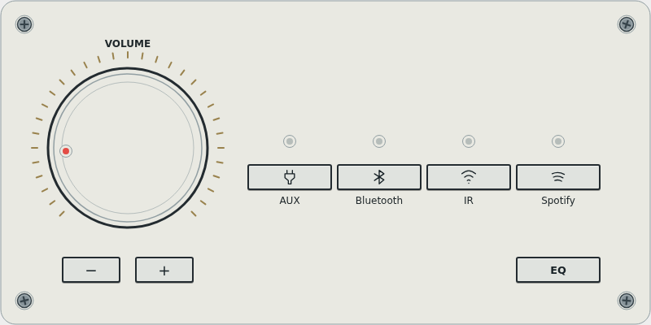
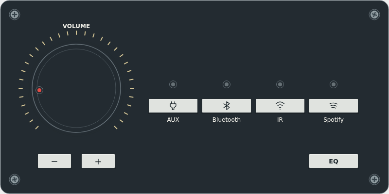

**A compact hi-fi amplifier card for Home Assistant.**

Neutral surfaces, a champagne volume scale and cassette-style source keys.

## Project Status

| Field | Current state |
|---|---|
| Maturity | Experimental |
| Used in my homelab | Not yet — simulated entities only |
| Recommended for production | Not yet |
| Setup difficulty | Intermediate |
| Documentation | Installation, configuration and development |
| Current version | 0.1.0 |
| Distribution | HACS custom repository |

> [!WARNING]
> This project is experimental. Chromium tests use simulated entities; live Home
> Assistant and physical-device validation remain pending.

## Why It Exists

A focused amplifier front panel with direct volume, source and sound preset controls.

## Interface

| Light | Dark |
|---|---|
|  |  |

These are screenshots of the implemented card with simulated data.

- Press the knob to turn the amplifier on or off. Its indicator is red when on
  and neutral when off, and follows the volume position.
- Drag upward/downward on the knob to increase/decrease volume. Releasing a drag
  never toggles power. Arrow keys adjust volume; Enter/Space toggle power.
- Use −/+ for precise 1% adjustments, configurable with `volume_step`.
- Source keys come exclusively from `source_list`. Airplay is not offered if it
  is only the current source. Inactive LEDs are neutral; active Bluetooth is blue,
  Spotify green, IR coral and other sources champagne.
- EQ opens a temporary preset selector populated from `sound_mode_list`.
  Escape closes it. There are no fabricated bass/treble controls.
- Commands and LED state follow the entity's supported features and reported state.
  Unavailable entities cannot receive commands. Service failures display an error.
- No metadata display, artwork, playback controls or embedded credentials.

## Installation and configuration

The standalone JavaScript module is `dist/ampmatrix-card.js`. It has no runtime
package dependencies and uses Home Assistant's existing service interface.
### HACS

Add `https://github.com/issu-lab/ampmatrix-card` under **HACS → Custom repositories**,
select **Dashboard**, then download AmpMatrix Card and refresh the browser.
It is a custom repository, not part of the default HACS catalog.

If necessary, register `/hacsfiles/ampmatrix-card/ampmatrix-card.js` as a JavaScript
module dashboard resource.

### Manual

Download `ampmatrix-card.js` from the [latest release](https://github.com/issu-lab/ampmatrix-card/releases/latest).
Copy it to `www/ampmatrix-card.js`, register `/local/ampmatrix-card.js` as a
JavaScript module dashboard resource, then configure:

```yaml
type: custom:ampmatrix-card
entity: media_player.living_room
color_mode: auto
language: auto
volume_step: 0.01
```

`color_mode`: auto/light/dark. `language`: auto/en/it. `volume_step`: >0 and ≤0.1.
A basic visual editor offers the entity and color mode. Other settings use YAML.
The entity must declare turn_on/turn_off, volume_set or volume_step,
select_source and select_sound_mode for the corresponding controls.
Precise steps require volume_set and a numeric volume_level; integrations with
only volume_step use their native volume_up/down services.

## Development and validation

```sh
node build.mjs
node tests/browser.mjs
```

The test requires Playwright and an installed Chromium executable. Set
`PLAYWRIGHT_MODULE` and `PLAYWRIGHT_BROWSERS_PATH` for externally installed tools.
The browser test intercepts preview requests and serves local files: no HTTP
server or Home Assistant connection is needed. `index.html` is a local simulator.

Validation covers power, off-state guards, volume precision, source and EQ commands,
drag/click separation, keyboard, unavailable entities, missing feature flags,
service errors, escaped source labels, screenshots and mobile overflow/touch height.
Test service payloads target only `media_player.demo`.

## Limits and next steps

- Real-device validation, WebKit and physical mobile testing remain pending.
- The compact layout is designed for the four supplied sources. Larger source
  lists need additional responsive layout work before being recommended.
- The rendered face is 2:1. EQ and service errors may add temporary content.
- [Roadmap](ROADMAP.md) and [changelog](CHANGELOG.md).

## License

[MIT](LICENSE).

---

<div align="center">

This project is part of the **iSSU Open Homelab ecosystem**.

<a href="https://github.com/issu-lab/Open-Homelab">
  
</a>

</div>
