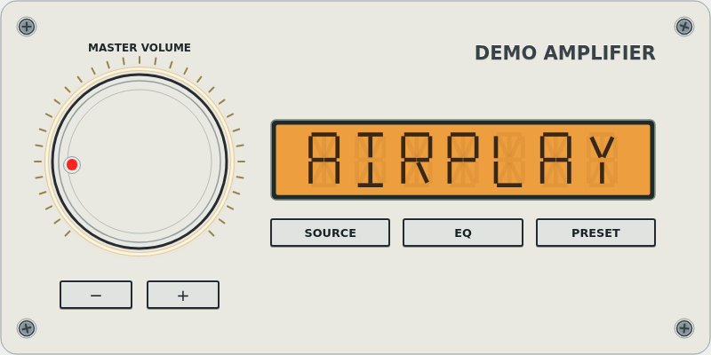
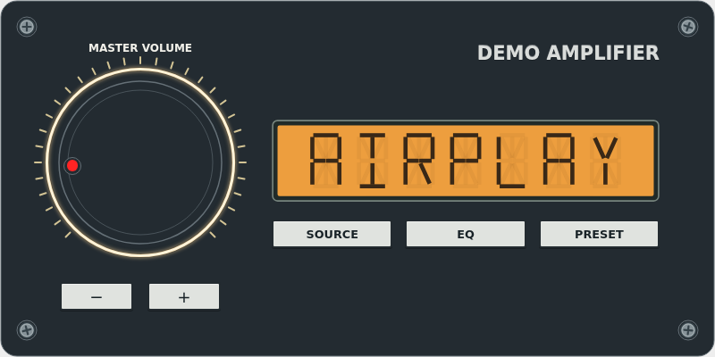

**A compact hi-fi amplifier card for Home Assistant.**

Neutral surfaces, a champagne master volume scale, warm-white power ring, orange segmented LCD and cassette-style controls.

## Project Status

| Field | Current state |
|---|---|
| Maturity | Experimental |
| Used in my homelab | User testing in progress |
| Recommended for production | Not yet |
| Setup difficulty | Intermediate |
| Documentation | Installation, configuration and development |
| Current version | 0.3.0 |
| Distribution | HACS custom repository |

> [!WARNING]
> This project is experimental. Automated tests use simulated entities. Early user
> testing is in progress; this version still needs live-device confirmation.

## Why It Exists

A focused amplifier front panel with direct volume, source and sound preset controls.

## Interface

| Light | Dark |
|---|---|
|  |  |

These are screenshots of the implemented card with simulated data.

- The device name appears above the LCD like an amplifier brand. It follows
  `friendly_name`, with an optional `name` override. Long names are ellipsized.
- The MASTER VOLUME ring glows warm white only when the amplifier reports on.
  It is neutral when off or unavailable. The −/+ group is centered on the knob.
- The LCD has less top/bottom padding while preserving segment size and weight.
- Press the knob to turn the amplifier on or off. Its indicator is red when on
  and neutral when off, and follows the volume position.
- Drag upward/downward on the knob to increase/decrease volume. Releasing a drag
  never toggles power. Arrow keys adjust volume; Enter/Space toggle power.
- Use −/+ or arrow keys for native `volume_up/down` steps when supported.
  Otherwise use `volume_set` with `volume_step` (default 1%).
- The orange LCD shows the reported source, including Airplay when it is not
  selectable. Bold segments retain faint inactive segments. When volume changes,
  it shows `VOL 34` (no percent sign) for two seconds, then returns to the source.
  This also follows external volume updates. It shows OFF when powered down.
- Two equal-width SOURCE and EQ keys open temporary selectors, populated from
  `source_list` and `sound_mode_list`. An unlisted current source can be displayed
  but cannot be selected. Escape or × closes the selector.
- Optional PRESET opens a list of configured scripts. With presets configured,
  SOURCE, EQ and PRESET share equal widths; otherwise only SOURCE/EQ appear.
  Opening or closing the menu never runs a script. Click a preset to send its
  command. Missing, unavailable and already-running scripts are disabled.
- The larger red knob LED indicates confirmed power state. Unknown/unavailable
  state shows `--` and disables amplifier commands.
- Commands and LED state follow the entity's supported features and reported state.
  Unavailable amplifier entities cannot receive media commands. Preset scripts have
  their own availability checks. Service failures display an error.
- No metadata display, artwork, playback controls or embedded credentials.

## Installation and configuration

The standalone JavaScript module is `dist/ampmatrix-card.js`. It has no runtime
package dependencies and uses Home Assistant's existing service interface.
### HACS

Add `https://github.com/issu-lab/ampmatrix-card` under **HACS → Custom repositories**,
select **Dashboard**, then download AmpMatrix Card and refresh the browser.
It is a custom repository, not part of the default HACS catalog.

If necessary, register `/hacsfiles/ampmatrix-card/ampmatrix-card.js` as a JavaScript
module dashboard resource.

### Manual

Download `ampmatrix-card.js` from the [latest release](https://github.com/issu-lab/ampmatrix-card/releases/latest).
Copy it to `www/ampmatrix-card.js`, register `/local/ampmatrix-card.js` as a
JavaScript module dashboard resource, then configure:

```yaml
type: custom:ampmatrix-card
entity: media_player.living_room
color_mode: auto
language: auto
volume_step: 0.01
```

`color_mode`: auto/light/dark. `language`: auto/en/it. `volume_step`: >0 and ≤0.1.
The visual editor offers the entity, color mode, optional front-panel name, and
script preset entries with optional labels. Language and volume_step use YAML.
The entity must declare turn_on/turn_off, volume_set or volume_step,
select_source and select_sound_mode for the corresponding controls.
`volume_step` is used only as a fallback when native stepping is unavailable;
it requires volume_set and a numeric volume_level.

### Script presets (0.3.0)

```yaml
type: custom:ampmatrix-card
entity: media_player.living_room
# Optional; otherwise the media player's friendly_name is used.
name: Living Room Amplifier
presets:
  - entity: script.listen_to_music
    name: Music
  - entity: script.movie_mode
    name: Cinema
```

The list is optional. Each entry requires a `script.*` entity and can have a
custom `name`; otherwise its friendly name is used. Configure existing scripts
in your Home Assistant instance. This card does not create or edit scripts.

Scripts may run while the amplifier is off or unavailable, so a preset can
include its own power-on sequence. Each script must exist and be idle (`off`)
to be offered as an executable action. The menu remains available to explain
unavailable entries. The card does not pass script variables in this version.

Preset actions call `script.turn_on` with the selected entity. A “command sent”
message confirms dispatch only, not successful completion of the script or an
active audio mode. No preset is marked as active. See the
[Home Assistant script documentation](https://www.home-assistant.io/integrations/script/#waiting-for-a-script-to-complete).

## Development and validation

```sh
node build.mjs
node tests/browser.mjs
```

The test requires Playwright and an installed Chromium executable. Set
`PLAYWRIGHT_MODULE` and `PLAYWRIGHT_BROWSERS_PATH` for externally installed tools.
The browser test intercepts preview requests and serves local files: no HTTP
server or Home Assistant connection is needed. `index.html` is a local simulator.

Validation covers power, off-state guards, volume precision, source and EQ commands,
drag/click separation, keyboard, unavailable entities, missing feature flags,
service errors, escaped source labels, updates during a held click, LCD timers,
external volume changes, screenshots and mobile overflow/touch targets.
The tests also cover preset target validation, no action on menu open, script
availability and errors, visual-editor configuration, name escaping, centered
volume controls, ring state and unchanged LCD glyph geometry.
Test service payloads target simulated `media_player.demo` and `script.demo_*`.
No physical device commands or real scripts are used in these tests.

## Limits and next steps

- Version 0.3.0 is verified locally with Chromium simulations only. Live script
  and device testing, WebKit and physical mobile validation remain pending.
- The segmented LCD supports Latin letters, digits and dashes. Other characters
  appear as dashes; the accessible label retains the original source. Long labels
  shrink to fit, with a 32-character visual limit.
- The rendered face is 2:1. EQ and service errors may add temporary content.
- [Roadmap](ROADMAP.md) and [changelog](CHANGELOG.md).

## License

[MIT](LICENSE).

---

<div align="center">

This project is part of the **iSSU Open Homelab ecosystem**.

<a href="https://github.com/issu-lab/Open-Homelab">
  
</a>

</div>
